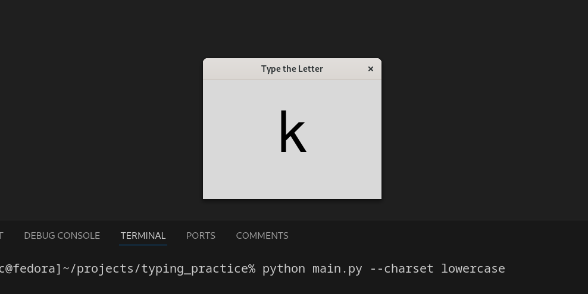
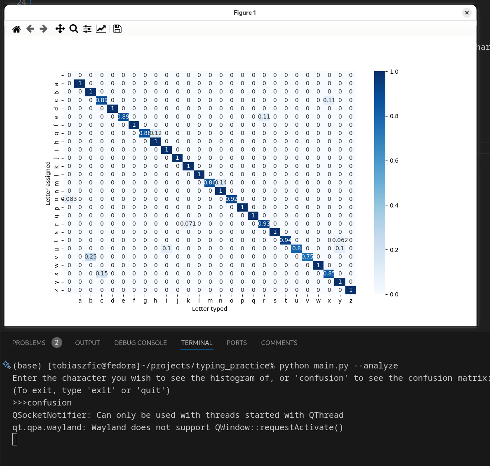
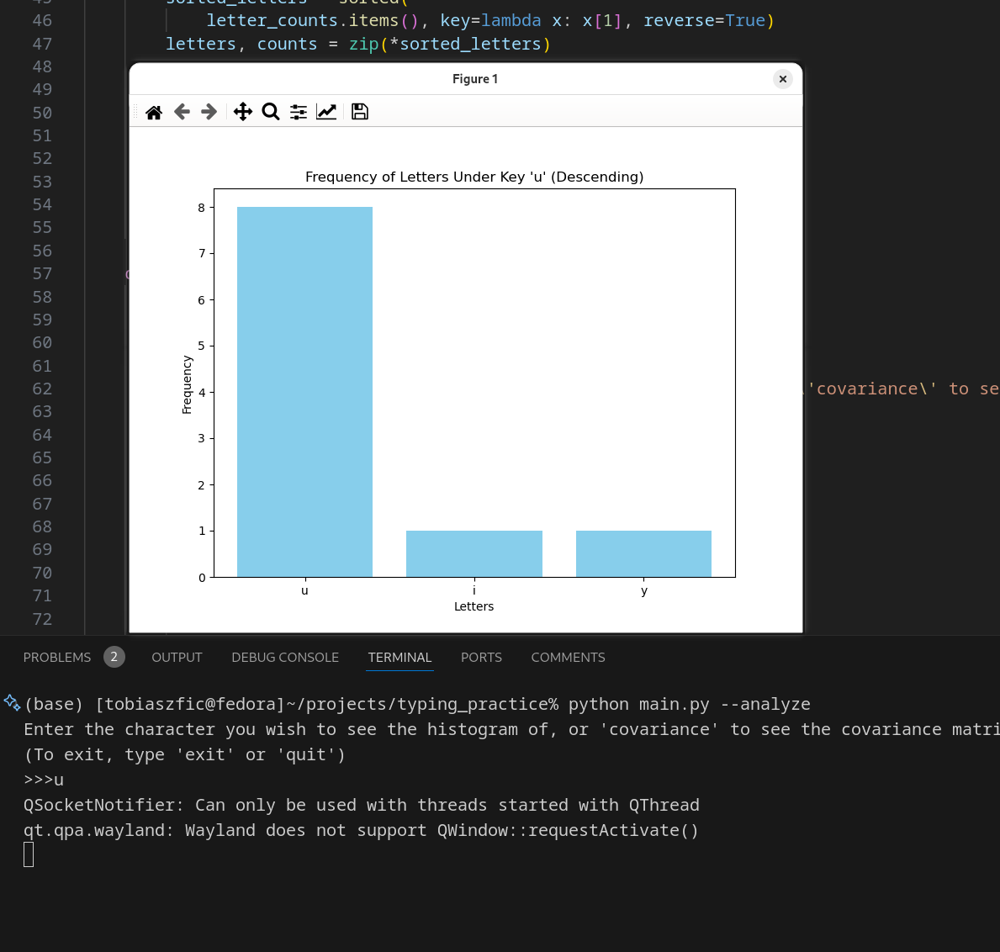

# Typemasterka

A simple applet for practicing typing of random characters one-by-one. Requires tkinter.



# Why?

I made this app because I wanted to practice typing in the simplest way possible to build muscle memory: letter appears on screen, you type it.

# To start

The standard: if missing packages, try:

```
pip install -r requirements.txt
```

Then 
```
python main.py <arguments>
```


Tip: add an alias in your `.bashrc`/`.zshrc` file to have the applet on quick access

```
alias typem=`~/path/to/main.py --input <path/to/stats.json> --charset <your-preferred-charset>`
```

# To view stats

```
python main.py --analyze
```

note: time stats are not included on purpose, focus on accuracy.





